# 场地预约系统

An easy, simple and speedy reservation system.

## 开始使用

本指南将指导你使用本系统或自己构建一个快速简洁的场地预约系统。

### 前置要求(使用)

一台电脑以及畅通的网络。

### 前置要求(自行构建)

Jdk1.8+ 本项目基于Jdk11构建，之前版本也许会遇到一些问题。

## 使用手册

### 注册&登录

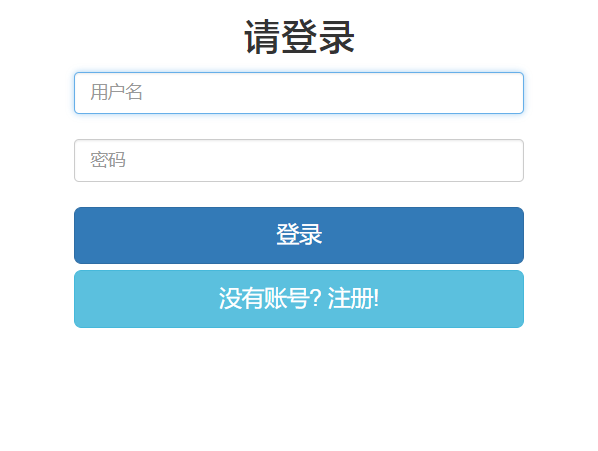

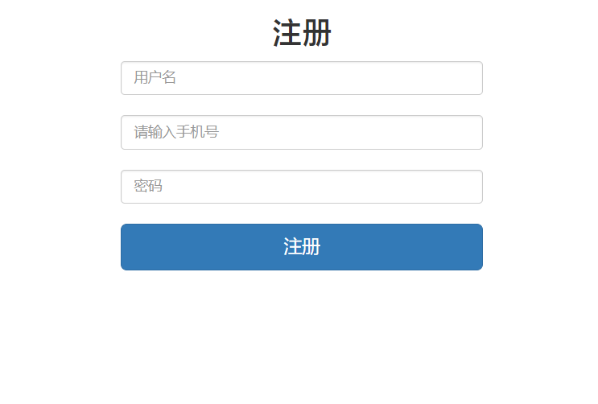

字面意义上的简洁明了。

### 普通用户界面

#### 场馆介绍

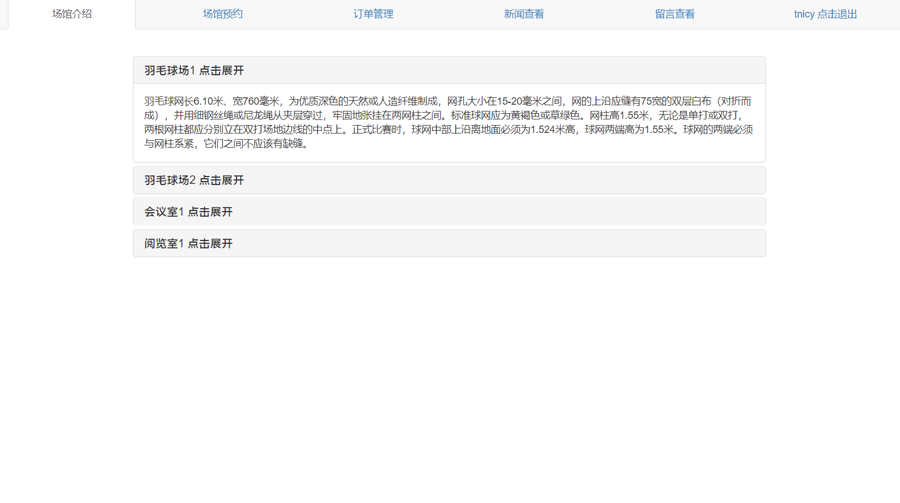

#### 用户预约场地

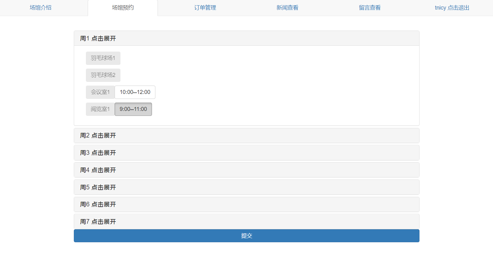

选中需要的场地时间段（可跨天跨场地多选），点击提交即可。

#### 订单管理

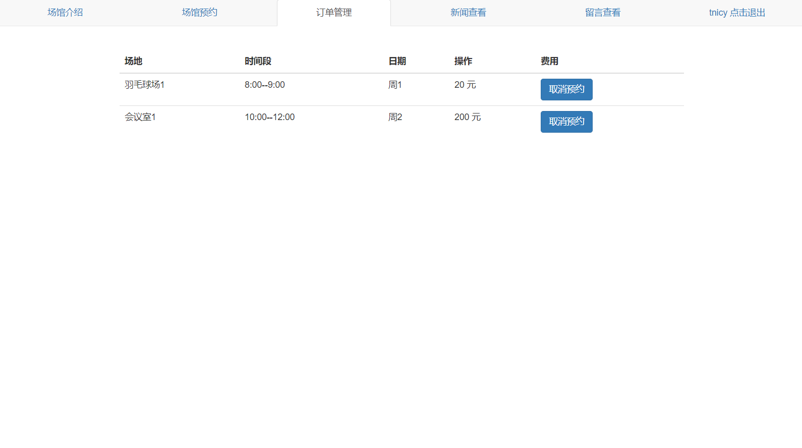

可以取消自己的预约。

#### 新闻查看

可以查看管理员发布的新闻。

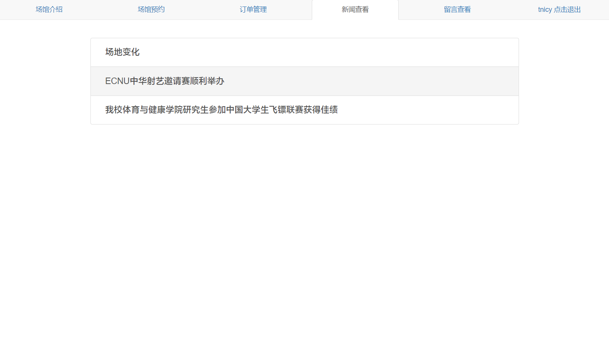

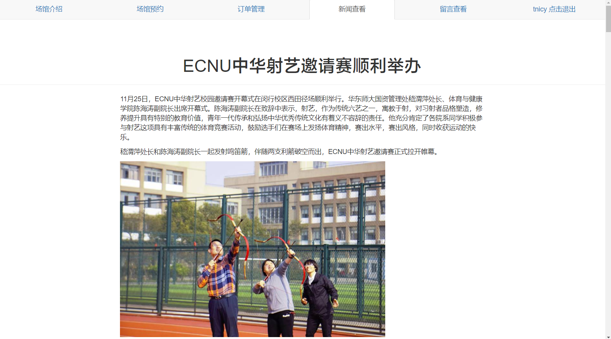

#### 留言查看

可以发布留言（支持富文本编辑，感谢[wangEditor](https://github.com/wangfupeng1988/wangEditor/))和查看别的用户的留言，也可以删除自己的留言。

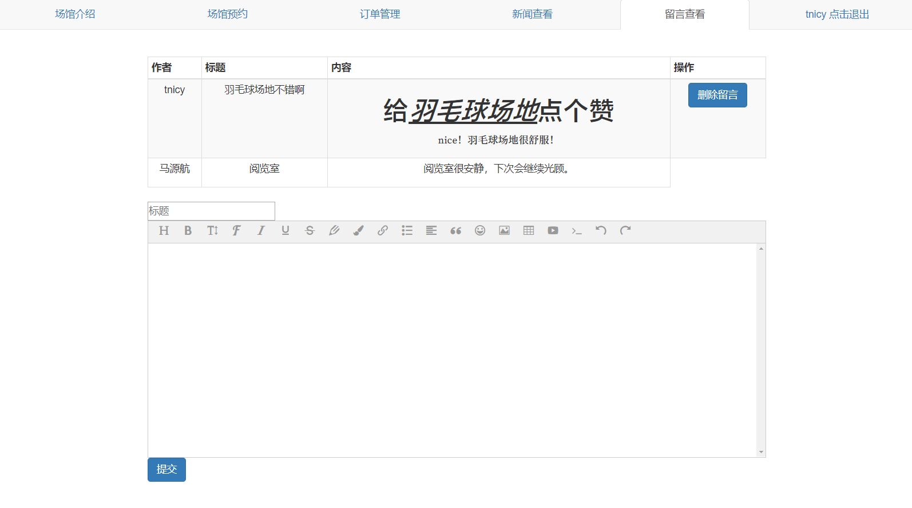

### 管理员界面

#### 场馆介绍管理

可以修改指定场地的介绍和新增场地。

#### 场地预约管理

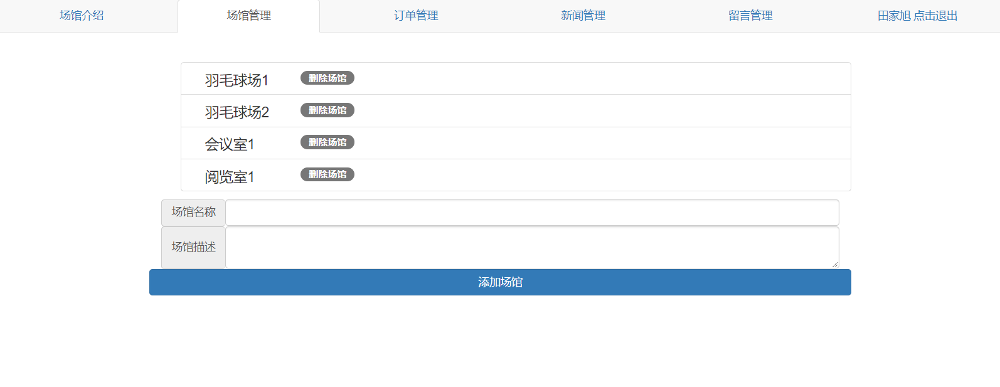

展开一个场地

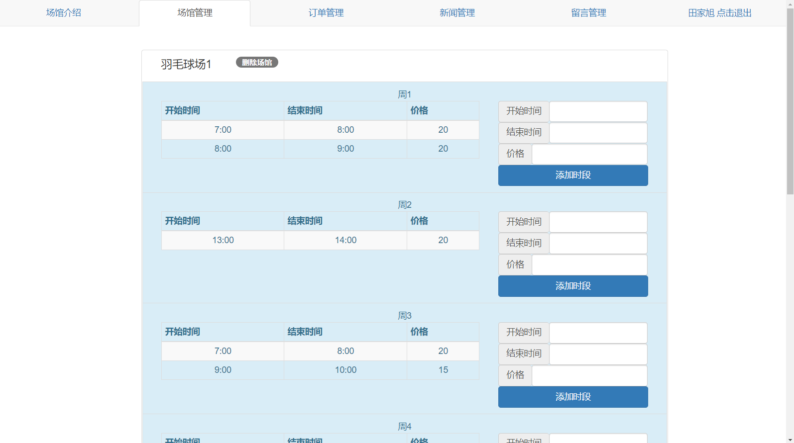

#### 订单管理

可以方便的取消某个用户的订单

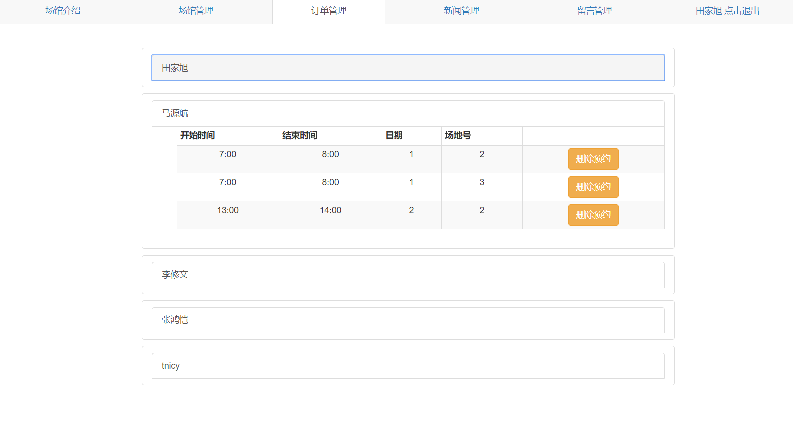

#### 新闻管理

管理员可以发布新闻，支持富文本编辑。

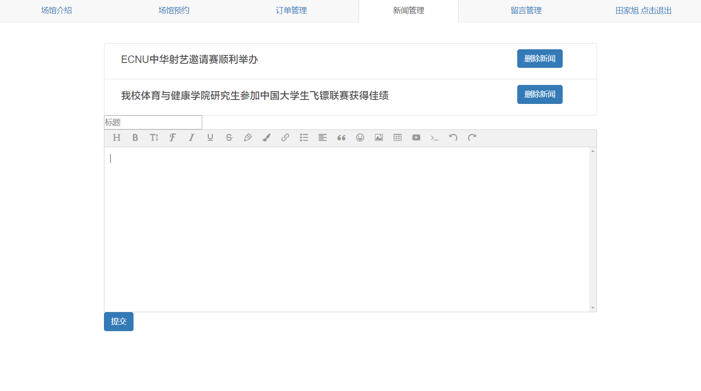

#### 留言管理

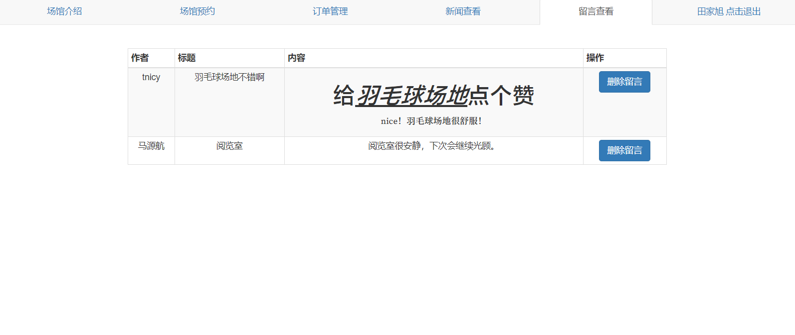

可以删除任意用户的留言

## Built With

* [Spring Boot](https://spring.io/projects/spring-boot) - java后端框架
* [Hibernate](http://hibernate.org/) - 数据持久化框架
* [Thymeleaf](https://www.thymeleaf.org/) - html模板引擎
* [Bootstrap](https://getbootstrap.com/) - 前端框架

## Authors

* **Tnicy**  - [Tnicy](https://github.com/Tnicy)

* **aptx4869tjx** - [aptx4869tjx](https://github.com/aptx4869tjx)

## License

This project is licensed under the MIT License.
